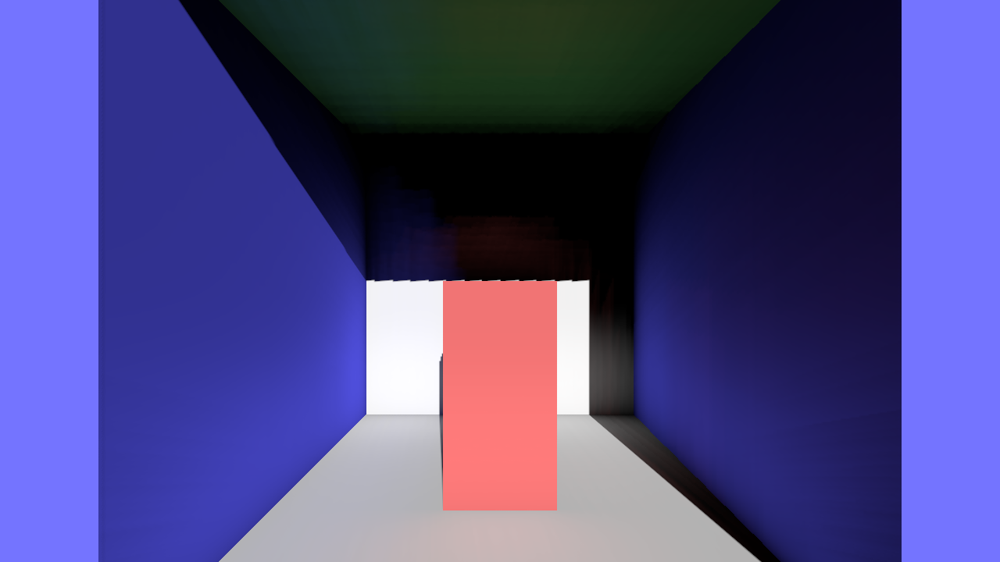
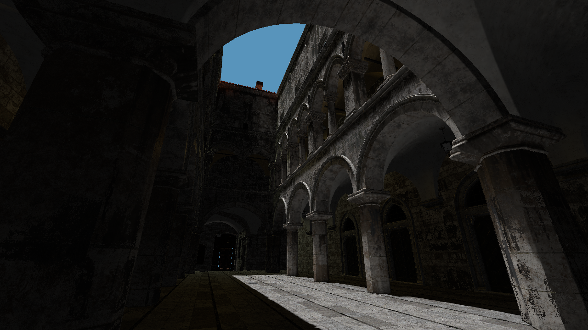

# Examples in this folder

## hello_triangle

A simple example showing how to render an RGB triangle.

## deferred

An implementation of a basic deferred renderer with a single directional light. This example also implements the paper Reflective Shadow Maps.

## gltf_viewer

A program that demonstrates the loading and rendering of glTF scene files using tinygltf and Fwog. Sponza glTF not included.

