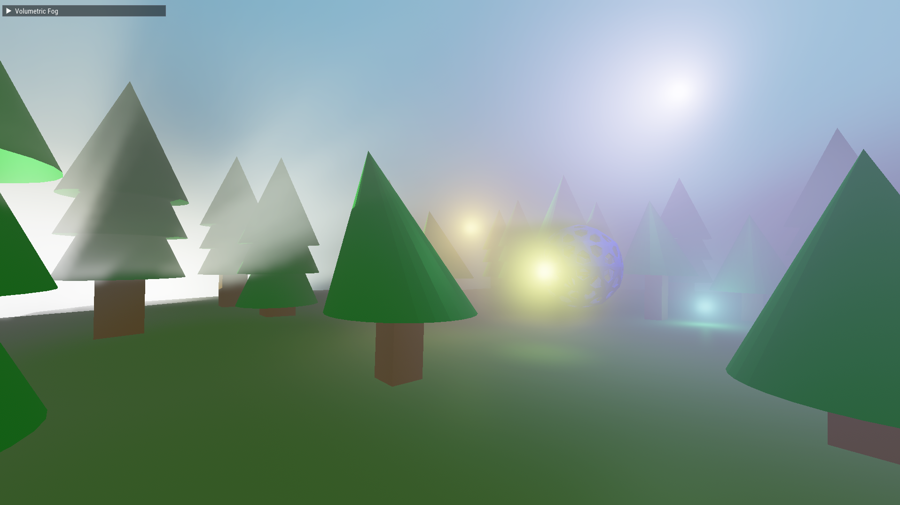
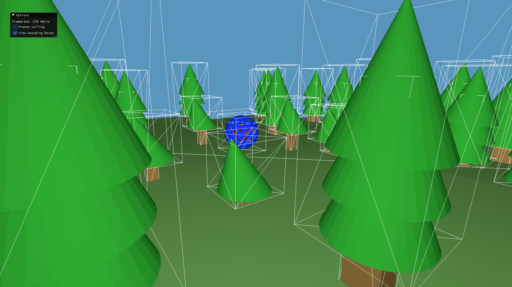

# Examples in this folder

## 01_hello_triangle

A simple example showing how to render an RGB triangle.

## 02_deferred

An implementation of a basic deferred renderer with a single directional light. This example also implements the paper Reflective Shadow Maps.

## 03_gltf_viewer

A program that demonstrates the loading and rendering of glTF scene files using tinygltf and Fwog. Sponza glTF not included.

## 04_volumetric

A ray-marched volumetric fog implementation using a frustum-aligned 3D grid. Supports fog shadows and local lights.

## 05_gpu_driven

An example using bindless textures, GPU-driven fragment shader occlusion culling, and indirect multidraw to minimize draw calls.

